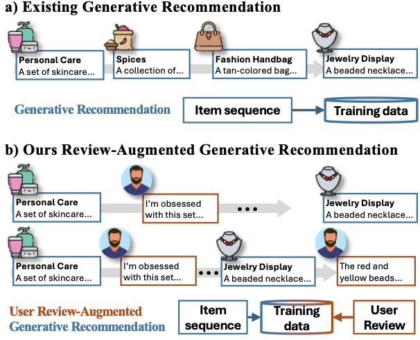

# RAGR: Generative Recommendation with Review-Augmented User Sequences

<p align="center">
  
</p>

<p align="center">
  <b>RAGR</b> extends generative recommendation from <i>item-only sequences</i> to <i>review-augmented user sequences</i>,
  enabling the model to learn not only <b>what</b> users interacted with, but also <b>why</b> they liked or disliked it.
</p>

<p align="center">
  <a href="#-overview">Overview</a> •
  <a href="#-framework">Framework</a> •
  <a href="#-motivation">Motivation</a> •
  <a href="#-repository-structure">Structure</a> •
  <a href="#-environment-setup">Environment</a> •
  <a href="#-data-layout">Data Layout</a> •
  <a href="#-pipeline">Pipeline</a> •
  <a href="#-dependencies">Dependencies</a>
</p>

## ✨ Overview

This repository contains the code for the paper **Generative Recommendation with Review-Augmented User Sequences**, featuring the proposed framework **RAGR** (*Review-Augmented Generative Recommendation*).

Unlike conventional generative recommendation methods that operate on item-only interaction sequences, RAGR incorporates **review feedback directly into the user sequence**. This allows the model to capture both:

- the behavioral outcome: what item the user interacted with
- the semantic evidence: why the user preferred or rejected it

To preserve the recommendation objective after introducing reviews, RAGR further applies **item-centric task alignment with DPO**, where the target item SID is treated as the preferred output and the review SID as the rejected output.

## 🧠 Framework

RAGR consists of two tightly coupled components:

### 1. Review-Augmented User Sequence Modeling

Instead of modeling user history as a plain item sequence, RAGR represents each historical step with both:

- an **item semantic ID**
- a **review semantic ID**

This turns the original item-only sequence into a richer generative context that reflects user preference formation more explicitly.

### 2. Item-Centric Task Generation Alignment

Once reviews are introduced into the sequence, the task should still remain centered on **next-item recommendation**.  
RAGR addresses this with a **DPO-based alignment strategy**, encouraging the model to treat:

- the target item SID as the `chosen` output
- the review SID as the `rejected` output

This ensures that reviews support item generation rather than becoming competing prediction targets.

## 🖼️ Motivation

<p align="center">
  
</p>

Existing generative recommendation methods typically model only what the user selected. RAGR moves one step further by incorporating post-decision review feedback into the sequence itself, making recommendation more semantically grounded.

## 🗂️ Repository Structure

```text
.
├── asset/                  # Paper PDF and figures used in the README
├── data/                   # Dataset directory (Beauty example data included)
├── data_process/           # Data preprocessing and text embedding generation
├── RQ-VAE/                 # Semantic ID tokenizer training and index generation
├── TIGER/                  # Generative recommendation training, evaluation, and DPO alignment
└── run.sh                  # End-to-end pipeline draft script
```

### Key modules

- `data_process/`
  - `data_preprocess_amazon.ipynb`: preprocessing entry for Amazon-style data
  - `amazon_text_emb.py`: generates item text embeddings from title/description
  - `amazon_text_emb_rev.py`: generates review text embeddings
- `RQ-VAE/`
  - `main.py`: trains the RQ-VAE tokenizer
  - `generate_indices.py`: generates semantic IDs for items
  - `generate_indices_rev.py`: generates semantic IDs for reviews
- `TIGER/`
  - `finetune.py`: trains the generative recommendation backbone
  - `finetune_dpo.py`: performs item-centric DPO alignment
  - `test.py`: evaluates recommendation performance
  - `data.py`: builds training/evaluation datasets for sequence recommendation and DPO pairs

## 🔧 Environment Setup

We recommend creating the environment directly from the provided [`environment.yml`](./environment.yml).

### Recommended: create from `environment.yml`

```bash
conda env create -f environment.yml
conda activate ragr
```

The environment file already includes the main dependencies used in this repository, including PyTorch, Transformers, TRL, Sentence-Transformers, Datasets, and related scientific computing packages.

### Optional: update an existing environment

```bash
conda env update -f environment.yml --prune
```

### Notes

- The environment name in the current file is `yy_tiger`.
- The provided configuration is CUDA-oriented and is best suited for GPU training.
- If your machine uses a different CUDA stack or CPU-only setup, you may need to adapt `environment.yml` accordingly.

## 📦 Data Layout

The code assumes dataset files are organized under `data/<Dataset>/`, for example:

```text
data/Beauty/
```

From the current implementation, the pipeline relies on files such as:

- `<Dataset>.item.json`: item textual metadata
- `<Dataset>.inter.json`: user interaction history and review-related content
- `<Dataset>.emb-t5-td.npy`: item text embeddings
- `<Dataset>.emb-t5-td_rev.npy`: review text embeddings
- `<Dataset><index_file>`: item semantic ID mapping
- `<Dataset>.review.json`: review semantic ID mapping

This repository currently includes example raw files for Beauty:

- `data/Beauty/meta_Beauty.json.gz`
- `data/Beauty/reviews_Beauty_5.json.gz`

## 🚀 Pipeline

Below is the practical training pipeline aligned with the current codebase.

### Step 1. Preprocess raw data

Use the preprocessing notebook:

- `data_process/data_preprocess_amazon.ipynb`

This step is expected to prepare intermediate files such as `*.item.json` and `*.inter.json`.

### Step 2. Generate item and review embeddings

```bash
python -u ./data_process/amazon_text_emb.py \
  --dataset Beauty \
  --root ./data \
  --plm_name t5 \
  --plm_checkpoint sentence-t5-base

python -u ./data_process/amazon_text_emb_rev.py \
  --dataset Beauty \
  --root ./data \
  --plm_name t5 \
  --plm_checkpoint sentence-t5-base
```

Expected outputs:

- `data/Beauty/Beauty.emb-t5-td.npy`
- `data/Beauty/Beauty.emb-t5-td_rev.npy`

### Step 3. Train the RQ-VAE tokenizer

```bash
python ./RQ-VAE/main.py \
  --device cuda:0 \
  --data_path ./data/Beauty/Beauty.emb-t5-td.npy \
  --rev_data_path ./data/Beauty/Beauty.emb-t5-td_rev.npy \
  --alpha 0.01 \
  --beta 0.0001 \
  --ckpt_dir ./RQ-VAE/tiger_checkpoint/
```

This stage learns the tokenizer that maps item/review representations into a unified semantic ID space.

### Step 4. Generate semantic IDs for items and reviews

```bash
python ./RQ-VAE/generate_indices.py \
  --dataset Beauty \
  --root_path ./RQ-VAE/tiger_checkpoint/ \
  --alpha 1e-4 \
  --beta 1e-4 \
  --epoch 2000 \
  --checkpoint ./RQ-VAE/tiger_checkpoint/xxx.pth

python ./RQ-VAE/generate_indices_rev.py \
  --dataset Beauty \
  --root_path ./RQ-VAE/tiger_checkpoint/ \
  --data_path ./data/Beauty/Beauty.emb-t5-td_rev.npy \
  --alpha 1e-1 \
  --beta 1e-4 \
  --epoch 2000 \
  --checkpoint ./RQ-VAE/tiger_checkpoint/xxx.pth
```

### Step 5. Train the generative recommender

```bash
torchrun --nproc_per_node=2 --master_port=2314 ./TIGER/finetune.py \
  --output_dir ./ckpt_rev/Beauty+RAGR/ \
  --dataset Beauty \
  --per_device_batch_size 256 \
  --learning_rate 5e-4 \
  --epochs 200 \
  --index_file .index.json \
  --rev_file .review.json \
  --temperature 1.0
```

This corresponds to the **Review-Augmented User Sequence Modeling** stage in the paper.

### Step 6. Evaluate the model

```bash
python ./TIGER/test.py \
  --ckpt_path ./ckpt_rev/Beauty+RAGR/ \
  --dataset Beauty \
  --data_path ./data \
  --results_file ./results/Beauty+RAGR/beauty_tiger.json \
  --test_batch_size 32 \
  --num_beams 20 \
  --test_prompt_ids 0 \
  --index_file .index.json \
  --rev_file .review.json
```

### Step 7. Apply DPO-based item-centric alignment

```bash
torchrun --nproc_per_node=2 --master_port=2314 ./TIGER/finetune_dpo.py \
  --sft_ckpt ./ckpt_rev/Beauty+RAGR/ \
  --output_dir ./ckpt_rev/Beauty+DPO/ \
  --dataset Beauty \
  --per_device_batch_size 256 \
  --learning_rate 1e-6 \
  --epochs 5 \
  --index_file .index.json \
  --rev_file .review.json \
  --temperature 1.0 \
  --save_and_eval_steps 200 \
  --beta 0.7 \
  --neg_k 5
```

This stage corresponds to **Item-Centric Task Generation Alignment**.

## 🛠️ Dependencies

The repository does not currently include a complete `requirements.txt`, but the code indicates that you will likely need:

- `python >= 3.10`
- `torch`
- `transformers`
- `datasets`
- `trl`
- `sentence-transformers`
- `numpy`
- `tqdm`
- `wandb`
